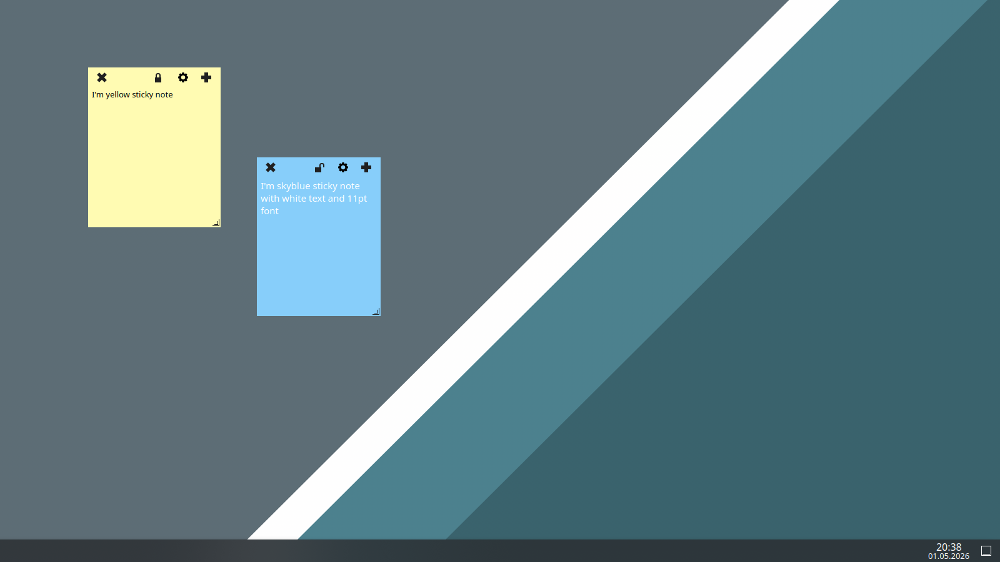

# QStickyNotes

**QStickyNotes** is a lightweight sticky notes application inspired by *indicator-stickynotes*, but it is not a full clone. It focuses on providing only the features that I personally use every day.

As the name suggests, QStickyNotes is written using Qt instead of GTK.

---

## Screenshot



---

## Features

* Tray-based application (no main window)
* Create notes from tray menu or directly from a note
* Frameless sticky notes with custom header
* Drag notes by header
* Resize notes from bottom-right corner
* Auto-save on focus loss, move, and resize
* Notes are restored on application startup
* Per-note customization:
  * Background color
  * Text color
  * Font
* Lock/unlock note editing
* Delete notes with confirmation dialog
* No scrollbars — notes automatically expand to fit content
* System language auto-detection (translations support)

---

## Wayland

On Wayland, window positioning is limited by the compositor.
For full functionality (window placement), run the app using XWayland:

QT_QPA_PLATFORM=xcb QStickyNotes

---

## Qt6 and Taskbar

If you want the notes to not appear in the taskbar, you can use KWin Window Rules and disable taskbar entries for QStickyNotes windows.

---

## Requirements

* Qt 5.15+ or Qt 6.4+
* CMake 3.28+
* C++17 compatible compiler

---

## Build

```bash
git clone https://github.com/ivnish/QStickyNotes.git
cd QStickyNotes

mkdir -p build/Release
cd build/Release

cmake -DCMAKE_INSTALL_PREFIX=/usr -DCMAKE_BUILD_TYPE=Release ../..
make -j$(nproc)
```

---

## Install

```bash
sudo make install
```

By default, this installs:

* Binary → `/usr/bin/QStickyNotes`
* Icons → `/usr/share/QStickyNotes/Icons`
* Translations → `/usr/share/QStickyNotes/translations`
* Desktop entry → `/usr/share/applications/QStickyNotes.desktop`

---

## Uninstall

```bash
sudo make uninstall
```

---

## Building a .deb Package

QStickyNotes can be packaged as a Debian package using CPack (included with CMake).

### Build the package

```bash
mkdir -p build/Release
cd build/Release

cmake -DCMAKE_INSTALL_PREFIX=/usr -DCMAKE_BUILD_TYPE=Release ../..
make -j$(nproc)

cpack
```

### Result

After running `cpack`, a `.deb` file will be generated in the build directory, for example:

```
qstickynotes-0.1-Linux.deb
```

### Install

```bash
sudo dpkg -i qstickynotes-*.deb
```

If there are missing dependencies:

```bash
sudo apt-get install -f
```

---

## Translations

QStickyNotes supports translations using Qt's translation system.

* Translation files are located in the `translations/` directory
* Language is detected automatically based on system locale

---

## License

GPLv3 License
